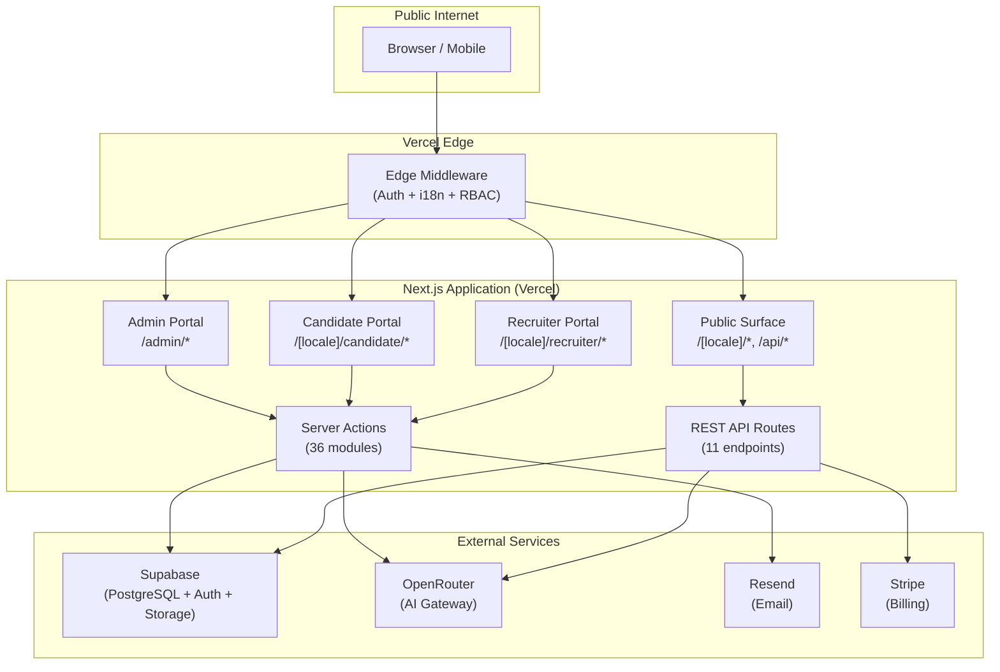
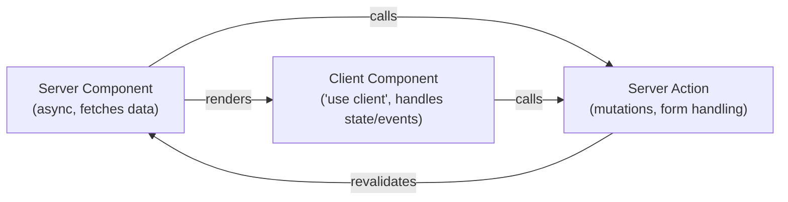
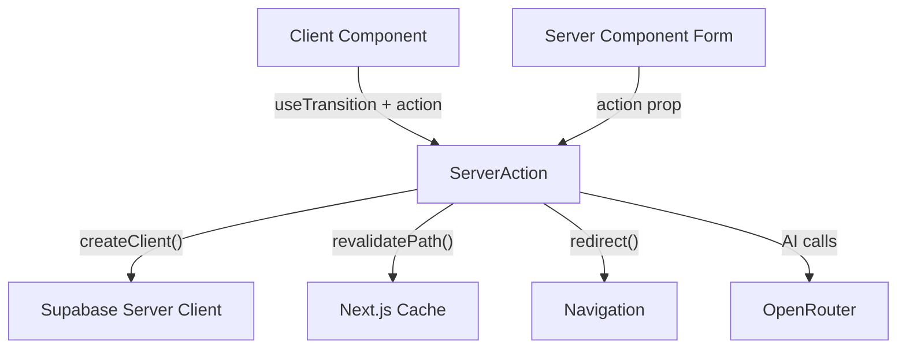
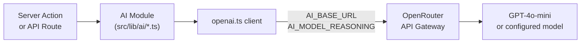
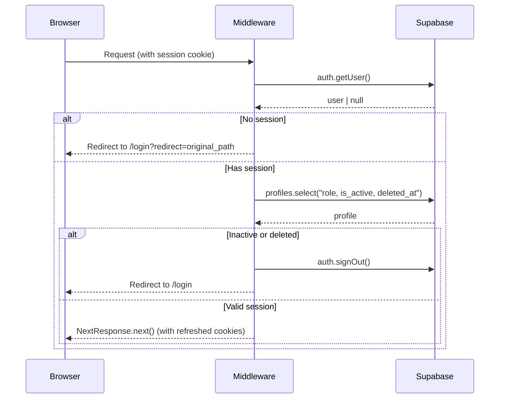
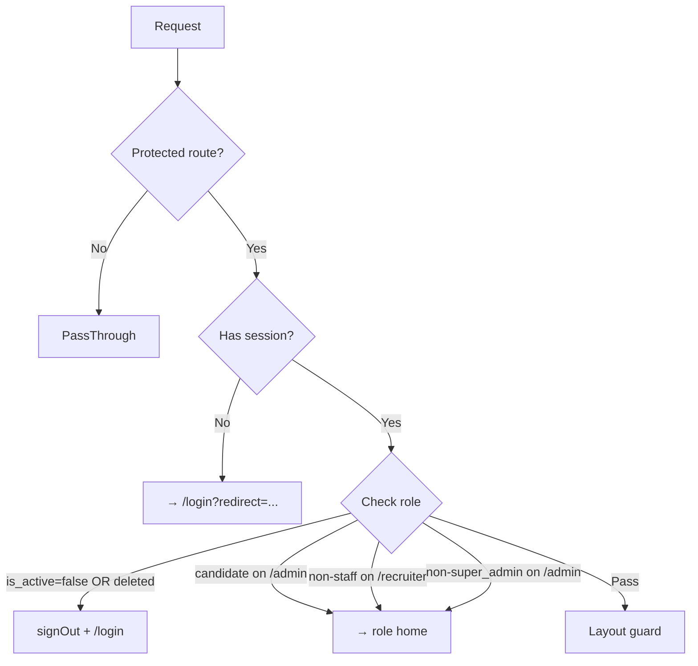
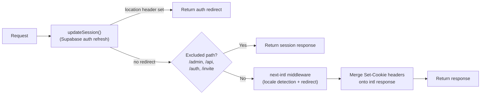
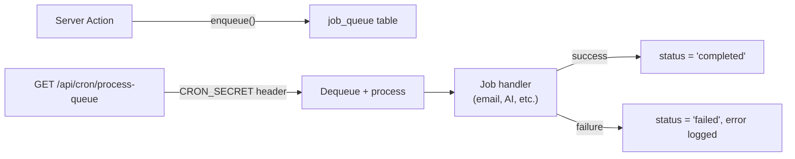
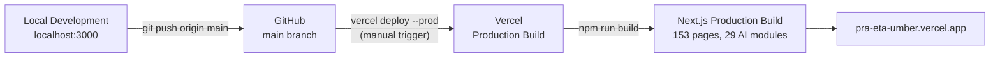

# System Architecture

> PRA Talent Intelligence Platform — Technical Architecture Document

---

## Table of Contents

1. [High-Level Overview](#1-high-level-overview)
2. [Frontend Architecture](#2-frontend-architecture)
3. [Backend Architecture](#3-backend-architecture)
4. [Database Layer](#4-database-layer)
5. [AI Layer](#5-ai-layer)
6. [Authentication](#6-authentication)
7. [Authorization & RBAC](#7-authorization--rbac)
8. [Middleware](#8-middleware)
9. [Storage](#9-storage)
10. [Background Jobs](#10-background-jobs)
11. [Email System](#11-email-system)
12. [Deployment Flow](#12-deployment-flow)
13. [Request Lifecycle](#13-request-lifecycle)

---

## 1. High-Level Overview

PRA Talent Intelligence Platform is a **multi-tenant, server-first SaaS application** built on Next.js 15 App Router. It serves three distinct user personas — Candidates, Recruiters, and Super Admins — through separate portal trees, each with its own layout, navigation, and data access scope.



### Design Principles

- **Server-first**: Data fetching happens in Server Components. Client components are opt-in.
- **Multi-tenant isolation**: Row Level Security enforces company-scoped data boundaries at the database layer.
- **Zero API proxying**: Server Actions replace REST APIs for most mutations — no API layer to maintain.
- **Composable AI**: 29 AI capabilities share a single configurable client — model swapping requires only an env var change.
- **Type-safe end-to-end**: TypeScript from Supabase schema types through components; Zod validates all user input.

---

## 2. Frontend Architecture

### Next.js App Router

The application uses the Next.js 15 App Router with a clear separation of server and client responsibilities:

```
src/app/
├── admin/                    # Unprefixed (super_admin only, no i18n)
├── api/                      # REST API routes
├── auth/callback/            # Supabase OAuth handler
├── invite/[token]/           # Team invitation acceptance
└── [locale]/                 # i18n-prefixed routes (en, ar)
    ├── (auth)/               # Route group — no nav layout
    ├── ai-tools/             # Guest AI tools hub
    ├── candidate/            # Authenticated candidate portal
    │   └── workspace/        # AI Career Workspace
    ├── companies/            # Public company profiles
    ├── jobs/                 # Public job listings
    ├── portfolio/            # Public candidate portfolios
    └── recruiter/            # Authenticated recruiter portal
```

### Component Model



**Rule**: Server Components fetch data directly from Supabase (no intermediate layer). Client Components receive data as props and call Server Actions for mutations.

### Portal Layouts

Each portal has its own shell layout that enforces authentication and provides navigation:

| Layout | Path | Auth Check | Nav Style |
|---|---|---|---|
| Admin Shell | `src/app/admin/layout.tsx` | `super_admin` only | Flat nav list |
| Candidate Shell | `src/app/[locale]/candidate/layout.tsx` | Any authenticated | Collapsible groups |
| Recruiter Shell | `src/app/[locale]/recruiter/layout.tsx` | `recruiter` or `super_admin` | Grouped sections |
| Auth Layout | `src/app/[locale]/(auth)/layout.tsx` | None (redirects if authed) | No nav |

### Shared Components (`src/components/shared/`)

| Component | Purpose |
|---|---|
| `DashboardShell` | Sidebar + topbar wrapper shared by all three portals |
| `CommandPalette` | Global ⌘K search across jobs, candidates, and nav |
| `LanguageSwitcher` | EN/AR locale toggle with cookie persistence |
| `ThemeProvider` | System + manual dark/light mode |
| `WebVitalsReporter` | Core Web Vitals collection |

### Internationalization

The platform supports English (default) and Arabic (RTL) via `next-intl`:

- Translation files live in `messages/en.json` and `messages/ar.json`
- All candidate and recruiter routes are prefixed with `/[locale]/`
- The admin portal is English-only (no locale prefix)
- RTL layout is driven by `<html dir="rtl">` set by `HtmlAttributesSync`
- The `LanguageSwitcher` component sets a `NEXT_LOCALE` cookie and navigates to the alternate locale

---

## 3. Backend Architecture

### Server Actions

Server Actions are the primary mutation layer. All 36 action modules live in `src/actions/` and are imported directly by Server and Client Components.



**Action conventions:**
- Every action creates a fresh Supabase server client (reads the session cookie)
- Input is validated with Zod before any DB write
- Mutations call `revalidatePath()` to invalidate affected Server Component caches
- Errors are returned as `{ error: string }` — never thrown to the client

### Query Layer

Read operations are organized in `src/lib/queries/` — pure async functions that accept a Supabase client and return typed data.

```
src/lib/queries/
├── admin.ts           # Platform-wide aggregates (admin portal)
├── analytics.ts       # RPC calls for chart data
├── applications.ts    # Application list and detail queries
├── candidate.ts       # Candidate profile and resume queries
├── copilot.ts         # Recruiter Copilot context aggregation
├── dashboard.ts       # Dashboard metric queries (both portals)
├── interviews.ts      # Interview list queries
├── jobs.ts            # Job listings and recruiter context
├── matching.ts        # AI match result queries
├── rbac.ts            # Role and permission queries
├── resume-builder.ts  # Resume builder draft queries
├── studio.ts          # Resume Studio queries
└── team.ts            # Team member and invite queries
```

---

## 4. Database Layer

The platform uses **Supabase (PostgreSQL 15)** with 49 migrations defining the complete schema.

### Key Design Decisions

- **Multi-tenant via company_id**: Every recruiter-owned record carries a `company_id` foreign key. RLS policies enforce that recruiters can only read and write their own company's data.
- **Row Level Security (RLS)**: Enabled on all tables. Policies use `auth.uid()` to identify the caller and `profiles.role` to scope access.
- **Soft deletes**: The `profiles` table uses `deleted_at` (nullable timestamp) for soft-deletion; hard deletes are not used for user records.
- **Audit log**: Every significant mutation is written to `audit_log` via application code (not triggers), preserving the actor, entity, and timestamp.

See [`docs/database/DATABASE_ERD.md`](DATABASE_ERD.md) for the full entity diagram and [`docs/database/DATA_DICTIONARY.md`](DATA_DICTIONARY.md) for the complete column-level reference.

---

## 5. AI Layer

All AI capabilities route through a single shared client:

```
src/lib/ai/openai.ts   ← shared OpenAI SDK client (pointed at OpenRouter)
```



### AI Modules (29 capabilities)

| Domain | Modules |
|---|---|
| Resume processing | `resume-parser`, `resume-improver`, `resume-builder`, `resume-studio-ops`, `ats-scorer` |
| Matching & discovery | `job-matcher`, `job-recommendations`, `embeddings` |
| Interview | `interview-questions`, `interview-summary`, `mock-interview`, `mock-interview-utils` |
| Career | `career-recommendations`, `salary-insights`, `guest-career-advisor`, `guest-interview-prep` |
| Recruiter tools | `candidate-insights`, `recruiter-copilot`, `job-description-writer`, `candidate-message-drafter` |
| Communication | `cover-letter`, `offer-letter` |
| Personal brand | `linkedin-optimizer`, `portfolio-ai` |
| Application | `application-insights` |
| Utilities | `extract-text`, `errors` |

### Streaming AI

The mock interview endpoint (`/api/mock-interview`) uses Server-Sent Events (SSE) for streaming responses, keeping the connection alive while the AI generates interview exchanges in real time.

---

## 6. Authentication

Authentication is handled by **Supabase Auth** with SSR cookie-based sessions.



### Auth Methods
- **Email + Password** — standard credential auth
- **Phone OTP** — SMS-based one-time password (migration 0040)
- **OAuth** — Supabase Auth handles social providers (configured per-project)

### Session Management
- Sessions are stored as HTTP-only cookies managed by `@supabase/ssr`
- The middleware calls `updateSession()` on every request to refresh expiring tokens
- Refreshed `Set-Cookie` headers are merged onto the response (including onto next-intl redirect responses)

---

## 7. Authorization & RBAC

Authorization is enforced at **three independent layers**:

### Layer 1: Edge Middleware (`src/lib/supabase/middleware.ts`)



### Layer 2: Server Component Layout Guards

Each portal layout re-verifies the session and role server-side, providing defense-in-depth:

```typescript
// Example from src/app/admin/layout.tsx
const user = await getCurrentUser();
if (!user) redirect("/login");
if (user.role !== "super_admin") redirect(...);
```

### Layer 3: Row Level Security (Supabase)

RLS policies at the database level ensure that even if application-layer checks were bypassed, a recruiter cannot read another company's data. Key policy patterns:

```sql
-- Recruiters see only their company's jobs
USING (company_id = (SELECT company_id FROM recruiters WHERE user_id = auth.uid()))

-- Candidates see only their own applications
USING (candidate_id = auth.uid())

-- Super admin bypass
USING (EXISTS (SELECT 1 FROM profiles WHERE id = auth.uid() AND role = 'super_admin'))
```

---

## 8. Middleware

The root middleware (`src/middleware.ts`) chains two concerns:



**Excluded from i18n routing**: `/admin`, `/api`, `/auth`, `/invite`, and static file routes (`/robots.txt`, `/sitemap.xml`, `/opengraph-image`).

---

## 9. Storage

Supabase Storage is used for resume file uploads:

- **Bucket**: `resumes` (private, RLS-protected)
- **File types**: PDF and DOCX
- **Size limit**: 10 MB (enforced in `uploadResume()` action; Next.js body limit raised to 15 MB to allow the app's own validation to run)
- **Access**: Files are accessed via signed URLs generated server-side — never publicly enumerable
- **Parsing**: Uploaded files are parsed immediately by `extractText()` using `pdf-parse` and `mammoth`

---

## 10. Background Jobs

Background processing uses a simple **database-backed job queue** (migration 0034):



The cron route is triggered by Vercel Cron (configured in `vercel.json`) and is protected by a `CRON_SECRET` header check.

---

## 11. Email System

Email is sent via **Resend** using a fire-and-forget pattern:

```typescript
// src/lib/notifications/dispatch.ts
export async function dispatch(to: string, subject: string, html: string) {
  void sendEmail({ to, subject, html }).catch(console.error);
}
```

Templates are stored in `email_templates` (database table, migration 0035) and can be managed from the Admin → Email panel without code changes.

**Triggered by:**
- Account registration (welcome email)
- Job application status changes (candidate notification)
- New job alert matches (candidate notification)
- Offer creation and response (both parties)
- Interview scheduling (candidate notification)

---

## 12. Deployment Flow



> **Note**: GitHub pushes do NOT auto-deploy. Production deployments require `vercel deploy --prod` from the CLI. See [`docs/deployment/DEPLOYMENT_GUIDE.md`](../deployment/DEPLOYMENT_GUIDE.md).

---

## 13. Request Lifecycle

A complete trace of a recruiter viewing the job pipeline:

```
1. Browser requests GET /en/recruiter/pipeline

2. Edge Middleware (src/middleware.ts):
   a. updateSession() → Supabase Auth refresh (reads sb-* cookies)
   b. path not excluded → intlMiddleware runs
   c. /en/recruiter/pipeline matches [locale]/recruiter pattern
   d. No locale redirect needed (already has /en/)

3. Supabase Middleware (src/lib/supabase/middleware.ts):
   a. auth.getUser() → user object
   b. profiles.select("role, is_active, deleted_at") → {role: "recruiter", is_active: true}
   c. isRecruiterRoute + STAFF_ROLES.includes("recruiter") → pass
   d. NextResponse.next() with refreshed session cookies

4. Next.js App Router resolves:
   src/app/[locale]/recruiter/layout.tsx (Server Component)
   a. getCurrentUser() → recruiter profile
   b. getRecruiterContext(user.id) → recruiter + company join
   c. getUnreadMessages() → badge count
   d. Renders DashboardShell with nav + children

5. src/app/[locale]/recruiter/pipeline/page.tsx (Server Component)
   a. getApplicationsByStage(company_id) → grouped applications
   b. Renders PipelineBoard with stage columns

6. PipelineBoard (Client Component, 'use client')
   a. Receives applications as props
   b. @dnd-kit enables drag-to-reorder
   c. onDrop → updateApplicationStatus() Server Action

7. Response streams to browser with React Server Components HTML
   Client hydration activates interactive elements only
```
