# C4 Architecture — Level 3: Component

> This diagram zooms into the Next.js Application container and shows its major internal components and their responsibilities.

---

## Component Diagram — Next.js Application

```mermaid
C4Component
    title Component Diagram — Next.js Application (src/)

    Container_Boundary(nextjs, "Next.js Application") {

        Component(middleware, "Edge Middleware", "src/middleware.ts", "First handler on every request. Validates session, detects locale, enforces RBAC, reads View As cookie.")

        Component(adminPortal, "Admin Portal", "src/app/admin/**", "Super Admin workspace. Users, companies, billing, feature flags, analytics, diagnostics, audit logs, job queue. Outside locale tree.")

        Component(candidatePortal, "Candidate Portal", "src/app/[locale]/candidate/**", "Job seeker workspace. Resume studio, career tools, application tracking, interview prep, AI workspace.")

        Component(recruiterPortal, "Recruiter Portal", "src/app/[locale]/recruiter/**", "Recruiter workspace. Pipeline, candidate search, messaging, offers, analytics, AI copilot.")

        Component(publicSurface, "Public Surface", "src/app/[locale]/(auth|ai-tools|jobs|portfolio|companies)/**", "Unauthenticated routes: login, register, job board, public portfolios, guest AI tools.")

        Component(apiRoutes, "API Routes", "src/app/api/**", "REST endpoints: /api/mock-interview (SSE streaming), /api/cron/* (cron jobs), /api/webhooks/stripe, /api/og (OG images), /api/web-vitals.")

        Component(serverActions, "Server Actions", "src/actions/**", "36 mutation modules. All data writes and AI orchestration. Protected by auth checks.")

        Component(queryLayer, "Query Layer", "src/lib/queries/**", "15 typed read-only modules. Supabase SDK calls with company-scoped RLS.")

        Component(aiModules, "AI Modules", "src/lib/ai/**", "29 AI capability modules. Unified openai.ts client. Covers resume, matching, interview, career, recruiter, communication.")

        Component(supabaseClients, "Supabase Clients", "src/lib/supabase/**", "Three client factories: browser.ts (client), server.ts (Server Component / Action), middleware.ts (Edge).")

        Component(authLib, "Auth Library", "src/lib/auth/**", "requireAuth(), getUser(), role guards. Used in layouts and Server Actions.")

        Component(emailLib, "Email Library", "src/lib/email/**", "dispatch.ts wraps Resend. Fire-and-forget pattern. Template files for each email type.")

        Component(validations, "Validation Schemas", "src/lib/validations/**", "Zod schemas for all forms and Server Action inputs. Shared between client and server.")

        Component(components, "UI Components", "src/components/**", "React components organized by portal: admin/, candidate/, recruiter/, workspace/, shared/, ui/ (shadcn primitives), super-admin/.")

        Component(i18n, "i18n Layer", "src/i18n/** + messages/", "next-intl routing, locale detection, en.json/ar.json translation files, RTL detection.")
    }

    System_Ext(supabase, "Supabase", "PostgreSQL + Auth + Storage")
    System_Ext(openrouter, "OpenRouter", "AI gateway")
    System_Ext(resend, "Resend", "Email delivery")

    Rel(middleware, supabaseClients, "Creates edge Supabase client to validate JWT")
    Rel(middleware, adminPortal, "Passes auth context to admin routes")
    Rel(middleware, candidatePortal, "Passes auth context to candidate routes")
    Rel(middleware, recruiterPortal, "Passes auth context to recruiter routes")

    Rel(adminPortal, serverActions, "Form submissions → mutations")
    Rel(candidatePortal, serverActions, "Resume saves, applications, AI calls")
    Rel(recruiterPortal, serverActions, "Pipeline moves, offers, messaging")

    Rel(adminPortal, queryLayer, "Dashboard data, user lists, analytics")
    Rel(candidatePortal, queryLayer, "Profile, resumes, applications, jobs")
    Rel(recruiterPortal, queryLayer, "Pipeline, candidates, stats, messages")

    Rel(serverActions, queryLayer, "Pre-write reads")
    Rel(serverActions, aiModules, "Delegate AI tasks")
    Rel(serverActions, emailLib, "Fire notification emails")
    Rel(serverActions, authLib, "Validate caller role")

    Rel(queryLayer, supabaseClients, "All DB reads via server client")
    Rel(serverActions, supabaseClients, "All DB writes via server client")
    Rel(aiModules, openrouter, "LLM inference")
    Rel(emailLib, resend, "Email delivery")
    Rel(supabaseClients, supabase, "DB + Auth + Storage calls")

    Rel(components, i18n, "useTranslations(), useLocale()")
    Rel(components, validations, "Form validation schemas")
    Rel(apiRoutes, supabaseClients, "Auth validation on API routes")
    Rel(apiRoutes, aiModules, "Streaming mock interview")
    Rel(apiRoutes, emailLib, "Cron-triggered alert emails")
```

---

## Component Inventory

### Portals

| Component | Entry Point | Auth Guard | Key Pages |
|---|---|---|---|
| **Admin Portal** | `src/app/admin/layout.tsx` | `requireRole('super_admin')` | Dashboard, Users, Companies, RBAC, Feature Flags, Billing, Diagnostics, Audit Log |
| **Candidate Portal** | `src/app/[locale]/candidate/layout.tsx` | `requireRole('candidate')` | Dashboard, Resume Studio, AI Workspace, Jobs, Applications, Interview Prep |
| **Recruiter Portal** | `src/app/[locale]/recruiter/layout.tsx` | `requireRole('recruiter')` | Dashboard, Pipeline, Candidate Search, Messaging, Offers, Analytics |
| **Public Surface** | `src/app/[locale]/(auth)/` | None | Login, Register, Forgot Password, Verify Email |
| **Guest AI Tools** | `src/app/[locale]/ai-tools/` | None (rate-limited) | ATS Checker, Career Advisor, Cover Letter, Interview Prep |

### API Routes

| Route | Method | Auth | Purpose |
|---|---|---|---|
| `/api/mock-interview` | POST | Session | Streaming AI mock interview (SSE) |
| `/api/cron/job-alerts` | GET | CRON_SECRET | Send scheduled job alert emails |
| `/api/cron/process-queue` | GET | CRON_SECRET | Process background job queue |
| `/api/cron/cleanup` | GET | CRON_SECRET | Remove stale notifications |
| `/api/webhooks/stripe` | POST | Stripe signature | Handle subscription events |
| `/api/og` | GET | None | Generate Open Graph images |
| `/api/web-vitals` | POST | None | Collect Core Web Vitals |
| `/api/health` | GET | None | Health check endpoint |
| `/api/comparison-pdf` | POST | Session | Generate candidate comparison PDF |

### Supabase Client Matrix

| Client | File | Used In | Capabilities |
|---|---|---|---|
| **Browser** | `src/lib/supabase/browser.ts` | Client Components | Auth state, realtime subscriptions |
| **Server** | `src/lib/supabase/server.ts` | Server Components, Server Actions, API Routes | Full CRUD, Auth SSR, Storage |
| **Middleware** | `src/lib/supabase/middleware.ts` | `src/middleware.ts` | Session refresh, JWT validation |

### AI Module Map

| Module | File | Capabilities |
|---|---|---|
| Resume AI | `resume-ai.ts` | Parse, improve, ATS score, section rewrite, tailor to job |
| Matching | `matching.ts` | Semantic job-candidate matching, ranked results |
| Interview | `interview.ts` | Question generation, mock interview streaming, post-interview summary |
| Career | `career.ts` | Career path advice, salary insights |
| Skills | `skills-gap.ts` | Gap analysis for target role |
| Cover Letter | `cover-letter.ts` | Role-tailored generation |
| Portfolio | `portfolio.ts` | Content assistance, public page generation |
| LinkedIn | `linkedin.ts` | Headline, summary, skills optimization |
| Copilot | `recruiter-copilot.ts` | Multi-intent recruiter assistant |
| Shortlist | `shortlisting.ts` | Automated candidate ranking with reasoning |
| Candidate Insights | `candidate-insights.ts` | Per-candidate suitability scoring |
| JD Generator | `jd-generator.ts` | AI job description creation |
| Message Drafter | `message-drafter.ts` | Recruiter-to-candidate message composition |
| Offer Letter | `offer-letter.ts` | Formal offer letter generation |
| Heatmap | `resume-heatmap.ts` | Resume section strength analysis |
| Brand Simulator | `recruiter-sim.ts` | Personal brand analysis |
| Guest Tools | `guest-ai.ts` | Rate-limited public AI tools |
