# C4 Architecture — Level 2: Container

> This diagram zooms into the PRA Platform system boundary and shows the major deployable units (containers) and how they communicate.

---

## Container Diagram

```mermaid
C4Container
    title Container Diagram — PRA Talent Intelligence Platform

    Person(candidate, "Candidate", "Job seeker using the platform")
    Person(recruiter, "Recruiter", "Hiring professional")
    Person(admin, "Super Admin", "Platform administrator")

    System_Boundary(pra, "PRA Talent Intelligence Platform") {

        Container(nextjs, "Next.js Application", "Next.js 15 / TypeScript", "Serves all UI pages and API surface. Handles authentication, routing, Server Components, Server Actions, and cron endpoints. Deployed to Vercel.")

        Container(middleware, "Edge Middleware", "Next.js Middleware / Edge Runtime", "Runs on every request before page render. Enforces auth, locale detection, RBAC route guards, and View As cookie inspection.")

        Container(serverActions, "Server Actions", "TypeScript / 'use server'", "36 server-side mutation modules. Handle all data writes, AI orchestration, and file operations. No direct browser access.")

        Container(queryLayer, "Query Layer", "TypeScript / Supabase SDK", "15 read-only modules exposing typed query functions. All data reads go through here.")

        Container(aiLayer, "AI Layer", "TypeScript / OpenAI SDK → OpenRouter", "29 AI capability modules. Composes prompts, calls OpenRouter, streams or returns structured JSON. Stateless — no AI data persisted.")

        Container(emailDispatch, "Email Dispatch", "TypeScript / Resend SDK", "Fire-and-forget email delivery. Called from Server Actions after key mutations.")

        Container(cronWorker, "Cron Worker", "Next.js API Route / Vercel Cron", "Handles background jobs on schedule: job alert emails, notification cleanup, queue processing. Secured by CRON_SECRET header.")

    }

    System_Ext(supabase_db, "Supabase PostgreSQL", "Primary relational database with 49-migration schema, RLS policies, and stored procedures")
    System_Ext(supabase_auth, "Supabase Auth", "Email/password, phone OTP, and OAuth authentication. Issues JWTs stored in HttpOnly cookies.")
    System_Ext(supabase_storage, "Supabase Storage", "Object storage for resume files (PDF/DOCX). Access controlled by RLS.")
    System_Ext(openrouter, "OpenRouter", "AI gateway (GPT-4o-mini default). OpenAI-compatible API.")
    System_Ext(resend, "Resend", "Transactional email delivery service")
    System_Ext(vercel_cdn, "Vercel CDN / Edge", "Global CDN, edge function execution, cron job scheduling")

    Rel(candidate, nextjs, "HTTPS browser requests — pages, forms, file uploads")
    Rel(recruiter, nextjs, "HTTPS browser requests — dashboard, pipeline, messaging")
    Rel(admin, nextjs, "HTTPS browser requests — admin portal, diagnostics")

    Rel(nextjs, middleware, "Every request processed before render", "Edge Runtime")
    Rel(middleware, supabase_auth, "Validates session JWT", "HTTPS")
    Rel(nextjs, serverActions, "Mutations via React Server Action protocol", "HTTP/2 (encrypted)")
    Rel(nextjs, queryLayer, "Data reads from Server Components and Server Actions", "In-process")
    Rel(serverActions, queryLayer, "Some actions read before writing", "In-process")
    Rel(queryLayer, supabase_db, "SQL queries with RLS enforcement", "HTTPS / pgwire")
    Rel(serverActions, supabase_db, "Insert/update/delete via Supabase SDK", "HTTPS / pgwire")
    Rel(serverActions, aiLayer, "Delegate AI tasks", "In-process (async)")
    Rel(aiLayer, openrouter, "LLM inference requests (streaming + JSON)", "HTTPS")
    Rel(serverActions, emailDispatch, "Trigger transactional emails", "In-process (fire-and-forget)")
    Rel(emailDispatch, resend, "Deliver emails via Resend API", "HTTPS")
    Rel(cronWorker, supabase_db, "Process queued jobs, send alerts", "HTTPS")
    Rel(cronWorker, emailDispatch, "Trigger alert/notification emails", "In-process")
    Rel(vercel_cdn, cronWorker, "Trigger cron routes on schedule", "HTTPS")
    Rel(nextjs, supabase_storage, "Upload/download resume files via signed URLs", "HTTPS")
```

---

## Container Descriptions

### Next.js Application
The single deployable unit for all user-facing logic. It combines:
- **Server Components** — HTML rendered on the server; no JS hydration unless interactive
- **Client Components** — React islands for interactive features (Kanban, streaming chat, forms)
- **Route Groups** — `/admin` (unprefixed), `/[locale]/(auth)`, `/[locale]/candidate`, `/[locale]/recruiter`, `/api`
- **Layouts** — DashboardShell with `headerExtra` slot injected per-portal

### Edge Middleware
Single file (`src/middleware.ts`) executing on Vercel Edge before every request:
1. Session validation via Supabase Auth SSR client
2. i18n locale detection and redirect
3. RBAC route enforcement (candidate/recruiter/admin prefix guards)
4. View As cookie inspection for super_admin role switching

### Server Actions (36 modules)
All state mutations happen here. Categories:
- Auth: `login.ts`, `register.ts`, `logout.ts`
- Resume: `resume.ts`, `resume-ai.ts`, `resume-builder.ts`
- Jobs: `jobs.ts`, `job-alerts.ts`, `saved-searches.ts`
- Applications: `applications.ts`, `interview.ts`, `offers.ts`
- Recruiter: `pipeline.ts`, `candidates.ts`, `messaging.ts`, `hiring-team.ts`
- AI: `ai-tools.ts`, `career-advisor.ts`, `portfolio.ts`
- Admin: `admin.ts`, `billing.ts`, `feature-flags.ts`, `notifications.ts`

### Query Layer (15 modules)
Read-only typed query functions. Each module corresponds to a domain:
`analytics.ts`, `applications.ts`, `candidates.ts`, `companies.ts`, `jobs.ts`, `messaging.ts`, `notifications.ts`, `offers.ts`, `pipeline.ts`, `profile.ts`, `recruiters.ts`, `resume.ts`, `salary.ts`, `skills.ts`, `users.ts`

### AI Layer (29 capabilities)
Stateless modules in `src/lib/ai/`. Each wraps a single AI capability:
- All use `src/lib/ai/openai.ts` client (OpenAI SDK → OpenRouter)
- Streaming capabilities use `stream: true` and return `ReadableStream`
- Structured capabilities return typed JSON via prompt engineering + JSON parsing
- No AI outputs are stored without explicit user action

### Email Dispatch
`src/lib/email/dispatch.ts` — wraps Resend SDK. Called fire-and-forget from Server Actions via `void dispatch(...)`. Errors are caught and logged but never surface to the user. Handles: welcome emails, job alert digests, offer notifications, application status updates.

### Cron Worker
`src/app/api/cron/` routes. Protected by `Authorization: Bearer CRON_SECRET` header. Vercel Cron triggers these on schedule (configured in `vercel.json`). Jobs include: job alert email delivery, expired notification cleanup, background AI processing queue drain.
