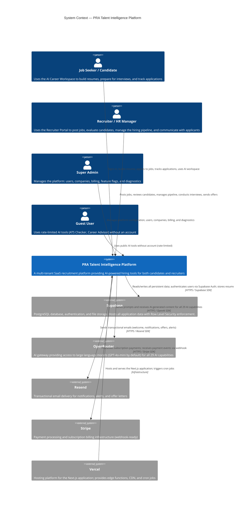

# C4 Architecture — Level 1: System Context

> This diagram shows the PRA Talent Intelligence Platform as a black box, the people who use it, and the external systems it depends on.

---

## Context Diagram

---

## Context Narrative

### Users

| Person | Volume | Primary Use Case |
|---|---|---|
| **Job Seeker** | High | Building competitive resumes, applying to jobs, interview prep |
| **Recruiter** | Medium | Finding candidates, managing hiring pipeline, analytics |
| **Super Admin** | Very Low | Platform configuration, billing, user management |
| **Guest** | High | Trying AI tools before registering |

### External Dependencies

| System | Criticality | Fallback |
|---|---|---|
| **Supabase** | Critical (P0) | None — all data is stored here |
| **OpenRouter** | High (P1) | AI features degrade gracefully (show error state) |
| **Resend** | Medium (P2) | Emails are fire-and-forget; failures are logged, not fatal |
| **Stripe** | Low (P3) | Billing UI shows read-only state; no financial data loss |
| **Vercel** | Critical (P0) | Platform is unavailable; no self-hosted fallback |

### Trust Boundaries

- All user requests enter through Vercel Edge (Next.js Middleware)
- No user data is stored outside Supabase (no third-party analytics with PII)
- AI prompts sent to OpenRouter include only the minimum data needed (resume text, job title — never full PII like email/phone)
- Stripe receives no resume or application data
