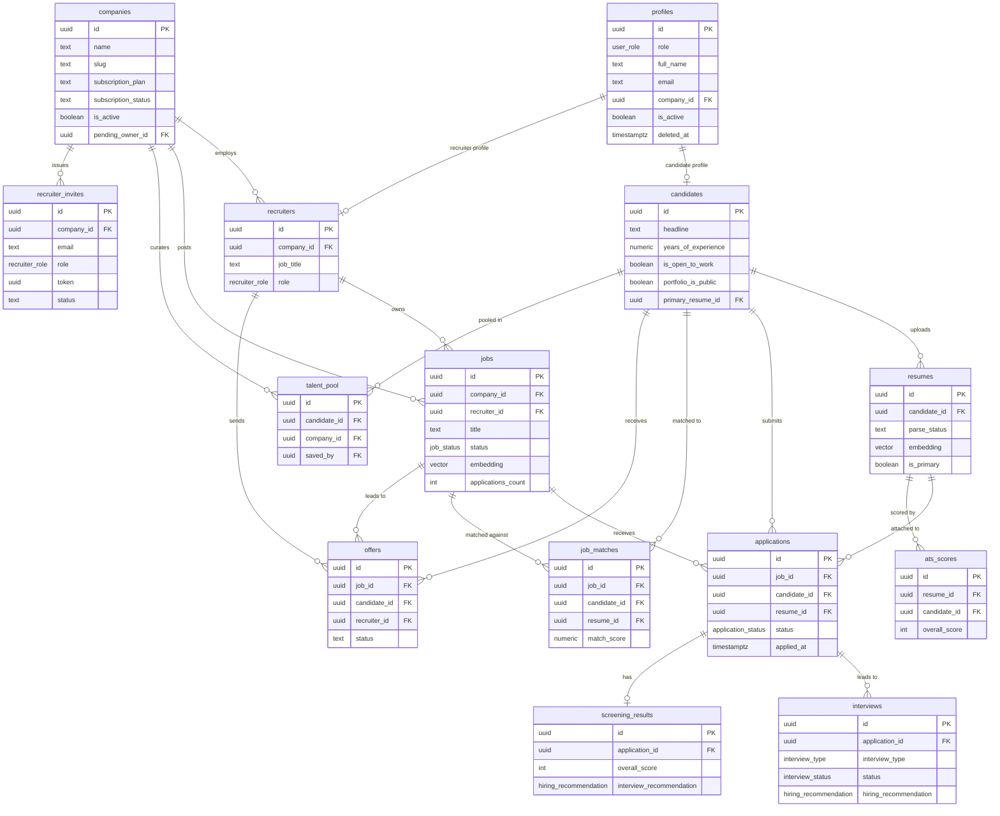
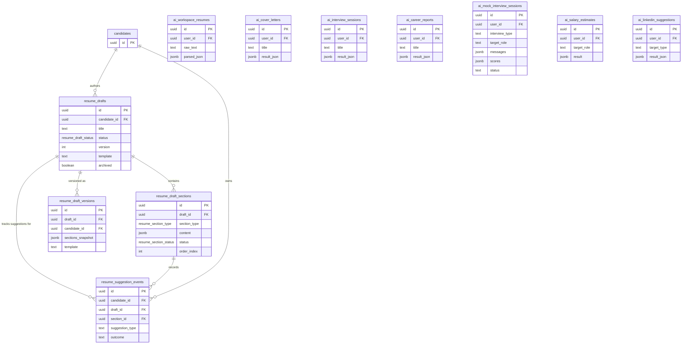
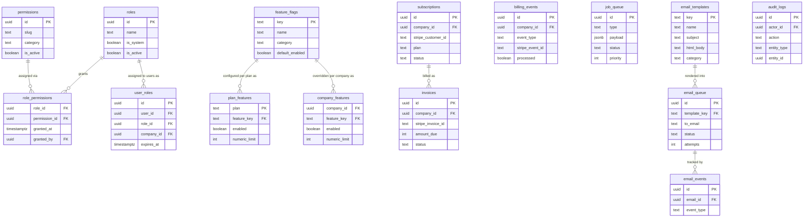

# PRA Talent Intelligence Platform — Database Entity Relationship Document

**Version:** 2.0  
**Database:** Supabase-hosted PostgreSQL (pg 15+)  
**Extensions:** uuid-ossp, pgcrypto, vector (pgvector 1536-dim), pg_trgm  
**Last updated:** 2026-08-09

---

## 1. Overview

The PRA Talent Intelligence Platform database is a multi-tenant, RLS-protected PostgreSQL schema hosted on Supabase. Every authenticated user maps to a row in `profiles` (created by trigger on `auth.users` insert). All sensitive tables enforce Row Level Security; helper functions (`is_staff()`, `is_admin()`, `my_company_id()`, `has_capability()`, `has_permission()`) are used throughout policies to avoid recursive RLS lookups.

**Key design principles:**

- **Multi-tenancy via company_id:** Recruiter-side data is always scoped to a `companies` row. Candidates are platform-wide.
- **Dual RBAC layers:** Platform-level roles (`profiles.role`: candidate / recruiter / hr_manager / super_admin) co-exist with a fine-grained permission system (`roles`, `permissions`, `role_permissions`, `user_roles`) added in v1.8 for admin-panel use.
- **AI-first schema:** Core tables (`resumes`, `jobs`) carry `vector(1536)` embedding columns for cosine-similarity search. AI outputs are stored as `jsonb` in dedicated tables.
- **Append-only audit tables:** `audit_logs` and `resume_suggestion_events` are insert-only by policy; `resume_suggestion_events` has a trigger that rejects any update to non-lifecycle columns.
- **Queue-backed async work:** `job_queue` and `email_queue` implement database-backed queuing for Vercel cron workers.

---

## 2. Core Entity Groups

### 2.1 Identity & Auth
| Table | Purpose |
|---|---|
| `profiles` | Extends `auth.users` with role, display name, company association, and IAM flags |

### 2.2 Company & Team
| Table | Purpose |
|---|---|
| `companies` | Multi-tenant root; holds subscription plan, billing status, and org settings |
| `recruiters` | Joins a profile to a company with a per-company role (owner/admin/recruiter/viewer) |
| `role_capabilities` | Data-driven map of recruiter_role → capability strings |
| `recruiter_invites` | Token-based teammate invite flow (7-day expiry) |
| `company_profiles` | Extended brand/culture page for a company |

### 2.3 Job Management
| Table | Purpose |
|---|---|
| `jobs` | Job postings with vector embedding for semantic search |
| `saved_jobs` | Candidate bookmarks on internal PRA jobs |
| `candidate_search_history` | Deduplicated record of searches with count tracking |
| `candidate_saved_searches` | Named search presets with optional alert scheduling |
| `candidate_job_alerts` | Scheduled alert jobs derived from saved searches |
| `candidate_recent_views` | Which PRA-hosted jobs a candidate has viewed |
| `candidate_ai_recommendations` | Cached AI career recommendation cards (24-hour TTL) |

### 2.4 Candidate & Applications
| Table | Purpose |
|---|---|
| `candidates` | Extended profile for job seekers |
| `candidate_experience` | Work history entries |
| `candidate_education` | Educational background |
| `candidate_skills` | Skills with proficiency level; AI-extraction flagged |
| `candidate_certificates` | Professional certifications |
| `candidate_languages` | Language proficiencies |
| `candidate_projects` | Portfolio projects |
| `candidate_achievements` | Awards and achievements |
| `candidate_social_links` | Platform-specific URLs |
| `resumes` | Uploaded resume files with AI parse results and vector embedding |
| `cover_letters` | Uploaded or generated cover letter files |
| `portfolio_items` | Portfolio media items (projects, publications, designs) |
| `resume_drafts` | Candidate-owned resume builder working copies |
| `resume_draft_sections` | Per-section content and AI suggestion state |
| `resume_draft_versions` | Point-in-time snapshots for version restore |
| `resume_suggestion_events` | Append-only audit log of AI writing suggestions |
| `applications` | Job application lifecycle records |
| `ats_scores` | AI-generated ATS compatibility scores per resume |
| `job_matches` | AI matching scores between a resume and a job |
| `screening_results` | Deep per-application AI screening scores |

### 2.5 Communication
| Table | Purpose |
|---|---|
| `message_threads` | One thread per recruiter–candidate pair |
| `messages` | Individual messages within a thread |
| `notifications` | In-app notifications for all users |
| `notification_preferences` | Per-user opt-in/out settings for notification types |

### 2.6 Intelligence & Hiring
| Table | Purpose |
|---|---|
| `interviews` | Scheduled interviews with feedback and competency ratings |
| `interview_questions` | AI-generated or manual question banks per job |
| `offers` | Formal job offers with lifecycle status |
| `offer_templates` | Reusable offer letter templates per company |
| `talent_pool` | Recruiter-curated candidate shortlists |
| `saved_candidates` | Recruiter bookmarks on candidate profiles |
| `recruiter_candidate_labels` | Color-coded recruiter labels on candidates |

### 2.7 AI Workspace (Cross-Platform Tools)
| Table | Purpose |
|---|---|
| `ai_workspace_resumes` | One active resume context per user for AI tools |
| `ai_cover_letters` | Saved AI-generated cover letter projects |
| `ai_interview_sessions` | Saved AI interview prep session results |
| `ai_career_reports` | Saved AI career analysis reports |
| `ai_salary_estimates` | AI salary estimate results per query |
| `ai_linkedin_suggestions` | AI-generated LinkedIn section rewrites |
| `ai_mock_interview_sessions` | Live mock interview sessions with per-answer scoring |

### 2.8 Platform Admin
| Table | Purpose |
|---|---|
| `feature_flags` | Master registry of feature toggles |
| `plan_features` | Default feature entitlements per subscription plan |
| `company_features` | Per-company overrides on feature flags |
| `subscriptions` | Stripe subscription metadata per company |
| `invoices` | Billing invoice records synced from Stripe |
| `billing_events` | Immutable log of all Stripe webhook events |
| `job_queue` | Database-backed async job queue |
| `email_templates` | HTML email templates with variable placeholders |
| `email_queue` | Outbound email jobs with retry tracking |
| `email_events` | Delivery event tracking (sent, opened, bounced) |
| `audit_logs` | Append-only platform audit trail |

### 2.9 RBAC (Fine-Grained Permission System)
| Table | Purpose |
|---|---|
| `roles` | Named role definitions (system and custom) |
| `permissions` | Atomic permission slugs organized by category |
| `role_permissions` | Many-to-many junction granting permissions to roles |
| `user_roles` | Assigns roles to users, optionally scoped to a company |

---

## 3. Mermaid ER Diagrams

### 3.1 Core Recruiting Entities

### 3.2 Resume Builder & AI Workspace

### 3.3 Platform Admin & RBAC

---

## 4. Key Foreign Key Relationships

### Identity Chain
- `auth.users` → `profiles` (1:1, cascade delete; trigger creates profile on user insert)
- `profiles` → `candidates` (1:1, cascade delete; a candidate IS a profile)
- `profiles` → `recruiters` (1:1, cascade delete; a recruiter IS a profile)
- `profiles` → `companies` via `company_id` (many:1, set null on company delete; links super_admin to their company directly)

### Company Hierarchy
- `companies` → `recruiters` (1:many via `company_id`)
- `companies` → `jobs` (1:many)
- `companies` → `recruiter_invites` (1:many)
- `companies` → `subscriptions` (1:1, unique)
- `companies` → `company_features` (1:many)
- `companies` → `company_profiles` (1:1, unique)
- `recruiters` → `companies` via `pending_owner_id` (1:1 nullable; tracks in-flight ownership transfer)

### Job → Application Pipeline
- `candidates` → `applications` (1:many)
- `jobs` → `applications` (1:many)
- `resumes` → `applications` (1:many; restrict delete to protect applied resume)
- `applications` → `screening_results` (1:1)
- `applications` → `interviews` (1:many)
- `interviews` → (feedback, recommendation stored inline)

### Offer Lifecycle
- `jobs` + `candidates` + `recruiters` + `companies` → `offers` (UNIQUE on job_id, candidate_id)
- `companies` → `offer_templates` (1:many)

### Resume Builder Chain
- `candidates` → `resume_drafts` (1:many)
- `resume_drafts` → `resume_draft_sections` (1:many, unique per section_type per draft)
- `resume_drafts` → `resume_draft_versions` (1:many snapshots)
- `resume_draft_sections` → `resume_suggestion_events` (append-only audit)

### Messaging
- `recruiters` + `candidates` → `message_threads` (UNIQUE per pair)
- `message_threads` → `messages` (1:many)

### RBAC
- `roles` ↔ `permissions` via `role_permissions` (many:many junction)
- `profiles` + `roles` + (optional) `companies` → `user_roles` (scoped assignment)

### Feature Flags
- `feature_flags` → `plan_features` (1:many, one row per plan)
- `feature_flags` → `company_features` (1:many, per-company override)

### AI Workspace
- All `ai_*` tables reference `auth.users(id)` directly (not `profiles`), so they work for unauthenticated/guest sessions that never create a profile row.

---

## 5. Row Level Security Summary

### Publicly Readable (no auth required)
| Table | Condition |
|---|---|
| `companies` | All rows |
| `jobs` | `status = 'published'` or same company or admin |
| `feature_flags` | All rows |
| `plan_features` | All rows |
| `roles` | All rows |
| `permissions` | All rows |
| `role_permissions` | All rows |
| `role_capabilities` | All rows |
| `email_templates` | `is_active = true` |
| `company_profiles` | `is_published = true` |
| `portfolio_items` | When `candidates.portfolio_is_public = true` |

### Owner-Only Access (user sees only their own rows)
| Table | Owner Column |
|---|---|
| `candidates` + all child tables | `id` / `candidate_id = auth.uid()` |
| `resumes`, `cover_letters`, `portfolio_items` | `candidate_id` |
| `resume_drafts`, `resume_draft_sections`, `resume_draft_versions` | `candidate_id` |
| `resume_suggestion_events` | `candidate_id` |
| `saved_jobs` | `candidate_id` |
| `candidate_search_history` | `candidate_id` |
| `candidate_saved_searches` | `candidate_id` |
| `candidate_job_alerts` | `candidate_id` |
| `candidate_recent_views` | `candidate_id` |
| `candidate_ai_recommendations` | `candidate_id` |
| `notifications` | `user_id` |
| `notification_preferences` | `user_id` |
| `ai_workspace_resumes` | `user_id` |
| `ai_cover_letters` | `user_id` |
| `ai_interview_sessions` | `user_id` |
| `ai_career_reports` | `user_id` |
| `ai_mock_interview_sessions` | `user_id` |
| `ai_salary_estimates` | `user_id` |
| `ai_linkedin_suggestions` | `user_id` |

### Staff-Readable (recruiter/hr_manager/super_admin can read candidate data)
| Table | Staff Access |
|---|---|
| `candidates` | Read via `is_staff()` |
| `candidate_experience`, `candidate_education`, `candidate_skills`, `candidate_certificates`, `candidate_languages`, `candidate_projects`, `candidate_achievements`, `candidate_social_links` | Read via `is_staff()` |
| `resumes`, `cover_letters`, `portfolio_items` | Read via `is_staff()` |
| `ats_scores` | Read via `is_staff()` |
| `job_matches` | Read via `is_staff()` or own company's job |
| `screening_results` | Write-only for staff; candidates read their own |
| `interviews` | Full management for staff |
| `interview_questions` | Full management for staff |

### Company-Scoped (recruiter sees own company's data)
| Table | Scope |
|---|---|
| `jobs` | `company_id = my_company_id()` for write; admin sees all |
| `applications` | Via job's company membership or admin |
| `talent_pool` | `company_id = my_company_id()` |
| `recruiter_invites` | `company_id = my_company_id()` AND `has_capability('invite_members')` |
| `company_features` | `company_id = my_company_id()` for read; admin for write |
| `subscriptions` | `company_id = my_company_id()` for read; admin for write |
| `invoices` | `company_id = my_company_id()` for read; admin for write |
| `saved_candidates` | Recruiter role assertion |
| `recruiter_candidate_labels` | Recruiter role assertion |
| `offer_templates` | `company_id = my_company_id()` |
| `offers` | `company_id = my_company_id()` for recruiter; `candidate_id = auth.uid()` for candidate |
| `message_threads` | `recruiter_id = auth.uid()` or `candidate_id = auth.uid()` |
| `messages` | Thread membership check |

### Super Admin Only
| Table | Access |
|---|---|
| `audit_logs` | Read only |
| `billing_events` | Full |
| `job_queue` | Full |
| `email_queue` | Full |
| `email_events` | Full |
| `user_roles` | Full (also user reads own) |
| `company_features` | Full write |
| `subscriptions` | Full write |
| `invoices` | Full write |
| `roles` | Write |
| `permissions` | Write |
| `role_permissions` | Write |

---

## 6. Key Enums

| Enum | Values |
|---|---|
| `user_role` | candidate, recruiter, hr_manager, super_admin |
| `employment_type` | full_time, part_time, contract, internship, temporary |
| `experience_level` | entry, junior, mid, senior, lead, manager, director, executive |
| `job_status` | draft, published, closed, archived |
| `application_status` | submitted, screening, shortlisted, interview, offer, hired, rejected, withdrawn, archived |
| `interview_type` | phone, video, onsite, technical, panel, final |
| `interview_status` | scheduled, completed, cancelled, no_show, rescheduled |
| `hiring_recommendation` | strong_yes, yes, neutral, no, strong_no |
| `proficiency_level` | beginner, intermediate, advanced, expert |
| `language_proficiency` | basic, conversational, fluent, native |
| `notification_type` | application_received, application_status_changed, interview_scheduled, interview_reminder, offer_extended, rejection, hiring_confirmed, job_match, system, job_alert, weekly_digest, ai_recommendation |
| `recruiter_role` | owner, admin, recruiter, viewer |
| `resume_draft_status` | draft, finalized |
| `resume_section_type` | personal_info, summary, experience, education, skills, certifications, languages, projects, achievements, social_links, volunteer, publications, references, interests, awards, courses |
| `resume_section_status` | empty, ai_suggested, accepted, edited |
